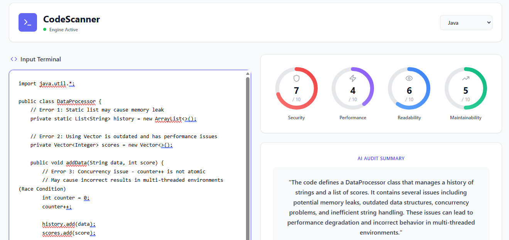
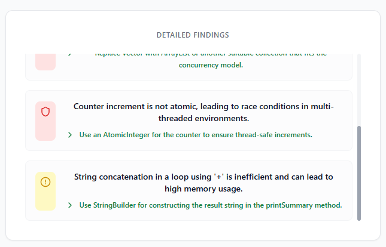

# CodeScanner.ai

> AI-Powered Code Review Agent with React Frontend & FastAPI Backend

An intelligent code analysis tool that provides professional code reviews, security assessments, and best practice recommendations using OpenAI GPT-4o-mini.

[](https://fastapi.tiangolo.com/)
[](https://reactjs.org/)
[](https://www.python.org/)
[](https://openai.com/)

---

## Overview

CodeScanner.ai is a full-stack application that analyzes code quality, security vulnerabilities, and performance issues across multiple programming languages. Built with React for the frontend and FastAPI for the backend, it provides real-time AI-powered code reviews.

---

## Key Features

### AI-Powered Analysis
Leverages OpenAI GPT-4o-mini for intelligent, context-aware code reviews

### Multi-Language Support
Supports Python, JavaScript, TypeScript, Java, C++, C#, Go, Rust, PHP, Ruby, and more

### Security Scanning
Identifies security vulnerabilities and unsafe coding practices

### Performance Insights
Detects performance bottlenecks and suggests optimizations

### Comprehensive Scoring
Provides metrics on security, performance, readability, and maintainability

### Smart Recommendations
Offers actionable suggestions for code improvement

### Modern UI
Clean, responsive React interface with real-time feedback

### Detailed Reports
Structured JSON responses with categorized issues and severity levels

---

## Tech Stack

### Frontend
- **React** - Modern UI framework
- **JavaScript** - Frontend logic
- **CSS3** - Styling and animations
- **Fetch API** - Backend communication

### Backend
- **FastAPI** - High-performance Python web framework
- **Pydantic** - Data validation and settings
- **OpenAI API** - GPT-4o-mini integration
- **Uvicorn** - ASGI web server

### AI/ML
- **OpenAI GPT-4o-mini** - Code analysis and recommendations

---

## Architecture

```
┌──────────────────────────────────────────────────────────┐
│                     User Interface                        │
│                    React Frontend                         │
│                     (Port 3000)                          │
└─────────────────────┬────────────────────────────────────┘
                      │
                      │ HTTP Requests
                      │ (POST /review, GET /health)
                      │
┌─────────────────────▼────────────────────────────────────┐
│                   FastAPI Backend                         │
│                     (Port 8000)                          │
│  ┌──────────────────────────────────────────────────┐   │
│  │  • Request Validation (Pydantic Schemas)         │   │
│  │  • Input Guardrails & Security Checks            │   │
│  │  • Language-Specific Prompt Engineering          │   │
│  │  • Response Parsing & Validation                 │   │
│  └──────────────────────────────────────────────────┘   │
└─────────────────────┬────────────────────────────────────┘
                      │
                      │ OpenAI API Call
                      │
┌─────────────────────▼────────────────────────────────────┐
│                  OpenAI GPT-4o-mini                      │
│              AI Code Analysis Engine                      │
└──────────────────────────────────────────────────────────┘
```

---

## Project Structure

```
codescanner-ai/
│
├── backend/
│   ├── main.py              # FastAPI application & routes
│   ├── config.py            # Configuration management
│   ├── schemas.py           # Data models & validation
│   ├── guardrails.py        # Security & input validation
│   ├── assistant.py         # OpenAI integration
│   ├── requirements.txt     # Python dependencies
│   └── .env                 # Environment variables
│
├── frontend/
│   ├── src/
│   │   ├── components/      # React components
│   │   ├── services/        # API services
│   │   ├── App.js           # Main component
│   │   └── index.js         # Entry point
│   ├── public/              # Static assets
│   ├── package.json         # Dependencies
│   └── .env                 # Frontend config
│
└── README.md
```

---

## Quick Start

### Prerequisites
- Python 3.8+
- Node.js 14+
- OpenAI API Key

### Installation

**1. Clone the repository**
```bash
git clone https://github.com/yourusername/codescanner-ai.git
cd codescanner-ai
```

**2. Setup Backend**
```bash
pip install -r requirements.txt
echo "OPENAI_API_KEY=your_key_here" > .env
python main.py
```

**3. Setup Frontend**
```bash
cd frontend
npm install
npm start
```

**4. Access the application**
- Frontend: http://localhost:3000
- API Docs: http://localhost:8000/docs

```env
# OpenAI Configuration
OPENAI_API_KEY=your_openai_api_key_here
OPENAI_MODEL=gpt-4o-mini
OPENAI_TEMPERATURE=0.1
OPENAI_MAX_TOKENS=2000

# Server Configuration
HOST=0.0.0.0
PORT=8000
DEBUG=False

# Assistant Mode
ASSISTANT_MODE=openai
```

### Step 4: Run the Server

```bash
python main.py
```

The API will be available at `http://localhost:8000`

---

## API Reference

### Health Check
```http
GET /health
```
**Response:**
```json
{
  "status": "online",
  "engine": "gpt-4o-mini"
}
```

### Code Review
```http
POST /review
Content-Type: application/json
```
**Request:**
```json
{
  "code": "def calculate_sum(a, b):\n    return a + b",
  "language": "python"
}
```
**Response:**
```json
{
  "summary": "Well-structured Python function with good practices.",
  "scores": {
    "security": 9.0,
    "performance": 8.5,
    "readability": 9.0,
    "maintainability": 8.0
  },
  "issues": [
    {
      "severity": "low",
      "category": "style",
      "description": "Missing type hints",
      "suggestion": "Add type annotations for better clarity"
    }
  ]
}
```

---

## Supported Languages

- Python
- JavaScript
- TypeScript
- Java
- C++
- C#
- Go
- Rust
- PHP
- Ruby

---

## Screenshots

### 1. Scanner Interface


### 2. Scan Results  


### 3. Detailed Findings


---

## How It Works

1. **User submits code** through React frontend
2. **Frontend sends request** to FastAPI backend
3. **Backend validates input** using Pydantic schemas and guardrails
4. **AI analysis** performed by OpenAI GPT-4o-mini
5. **Results parsed** and validated
6. **Response returned** to frontend with scores and recommendations

---

## Features Breakdown

### Backend Features
- ✅ Language-specific code analysis
- ✅ Security vulnerability detection
- ✅ Performance optimization suggestions
- ✅ JSON response validation
- ✅ Input sanitization and guardrails
- ✅ OpenAI GPT-4o-mini integration
- ✅ RESTful API with FastAPI
- ✅ CORS enabled for frontend

### Frontend Features
- ✅ Interactive code editor
- ✅ Multi-language support dropdown
- ✅ Real-time code analysis
- ✅ Visual score indicators
- ✅ Categorized issue display
- ✅ Severity-based color coding
- ✅ Responsive design
- ✅ Loading states and error handling

---

## Contributing

Contributions are welcome! Feel free to:
- Report bugs
- Suggest new features
- Submit pull requests


---

## Contact

For questions or collaboration:
- Open an issue on GitHub
- Email: safaa.acmk22@gmail.com


**⭐ Star this project if you find it useful!**
